<!-- Section images live in .github/readme/ and are generated by .github/readme/gen.py. Keep this file as ONE html block (no blank lines) so GitHub renders sections edge to edge. -->

<a href="https://jboxai.com/assets/jbox-prompt-to-product.mp4">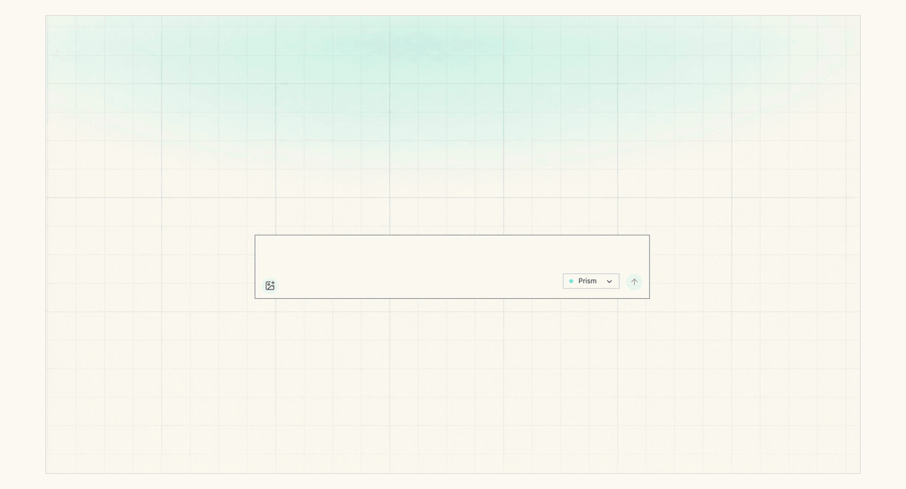</a>

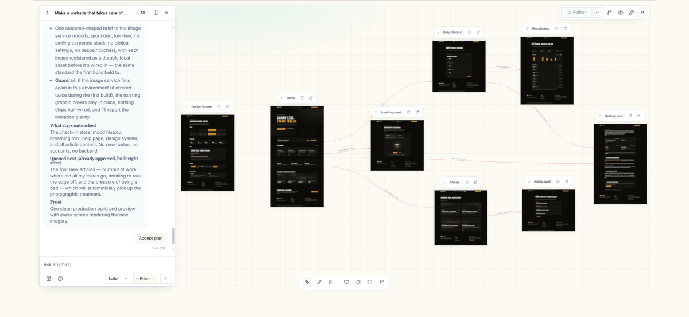

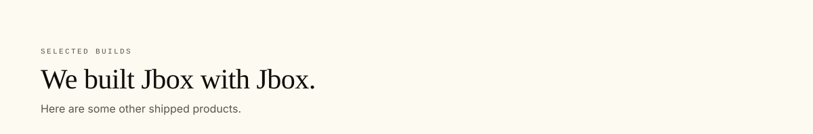
<a href="https://dermalens.io/">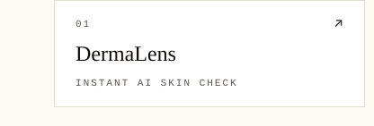</a><a href="https://www.redmondharveyclothing.com/">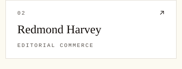</a><a href="https://www.anantrix.in/">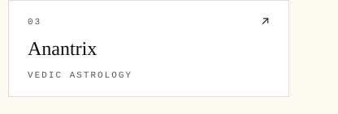</a>
<a href="https://fronted.com/employer-of-record">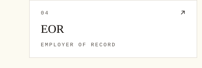</a><a href="https://www.projectresist.org.uk/">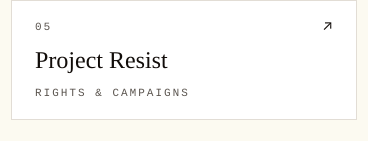</a><a href="https://www.grecapital.com/">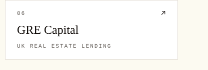</a>

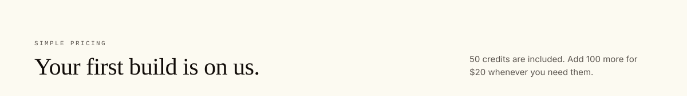
<a href="https://jboxai.com">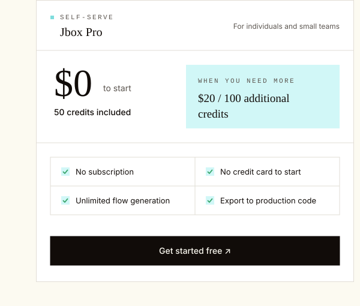</a><a href="mailto:contact@jboxai.com">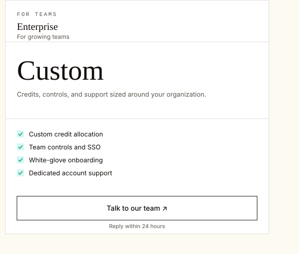</a>
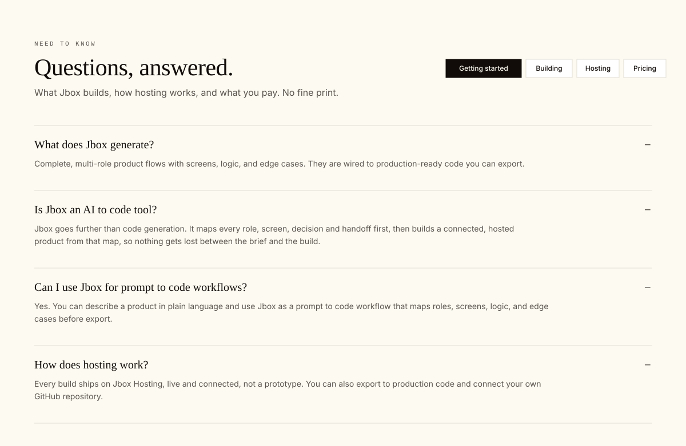

<a href="https://linkedin.com/in/jacques-louw-32590aa2">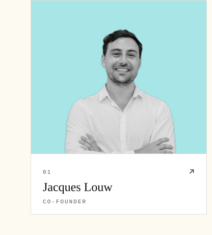</a><a href="https://linkedin.com/in/saurav-chanda">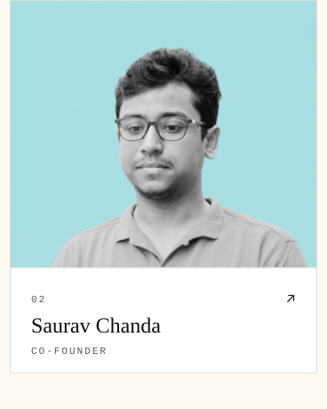</a><a href="https://www.linkedin.com/in/pawanpyakurel/">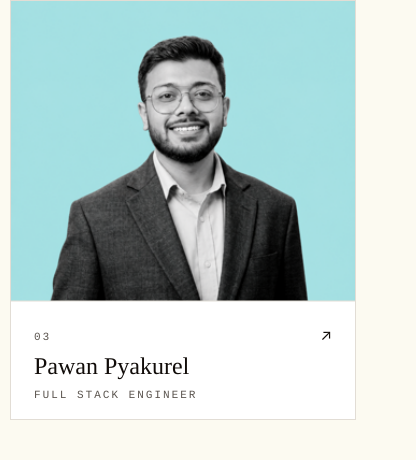</a>

<a href="https://jboxai.com">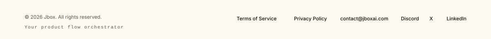</a>

