<!-- Assets live in .github/readme/ — regenerate SVGs with .github/readme/gen.py --> <a href="https://jboxai.com"> 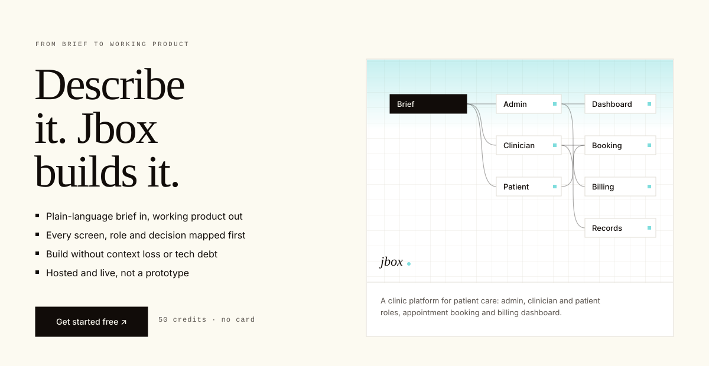 </a> 
 <a href="https://jboxai.com"><b>Get started free</b></a> &nbsp;·&nbsp; <a href="https://discord.gg/G2WprasNrq">Discord</a> &nbsp;·&nbsp; <a href="https://x.com/JBOXAI">X</a> &nbsp;·&nbsp; <a href="https://www.linkedin.com/company/jboxai/">LinkedIn</a> &nbsp;·&nbsp; <a href="https://www.g2.com/products/jbox/reviews">4.6 / 5 on G2</a> 
   <a href="https://jboxai.com/assets/jbox-prompt-to-product.mp4"> 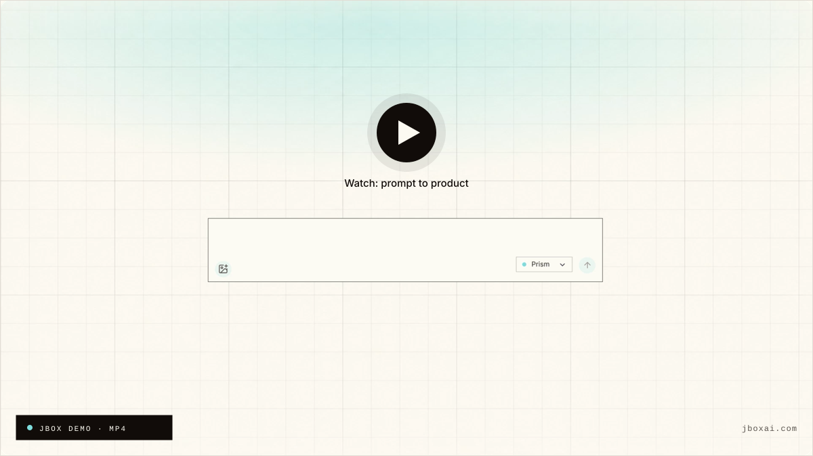 </a> 
▶ Click to watch the demo (MP4, ~19 MB)
   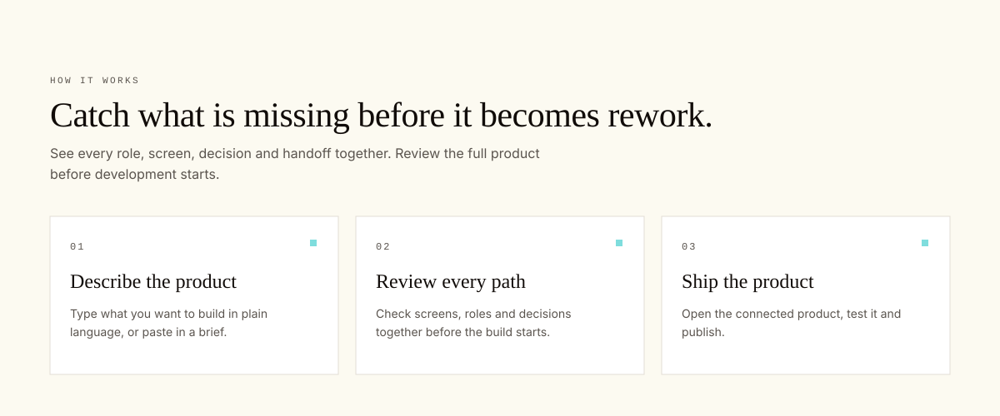 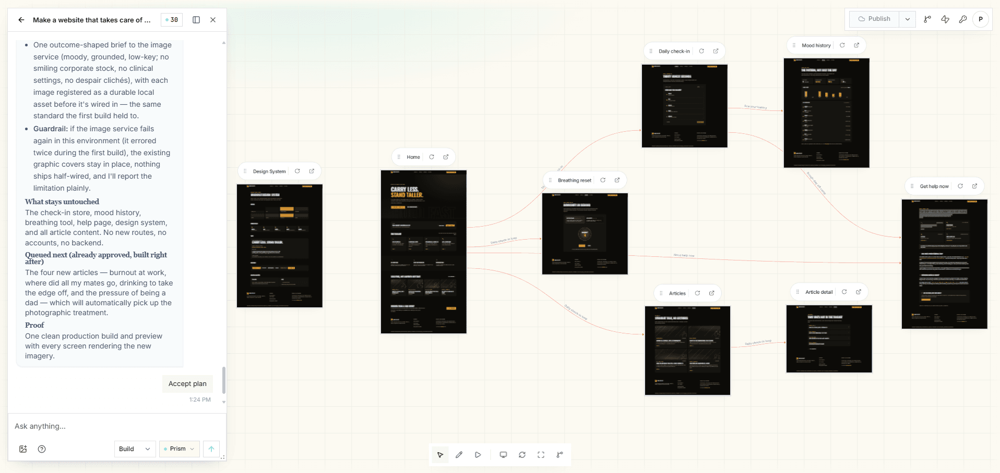 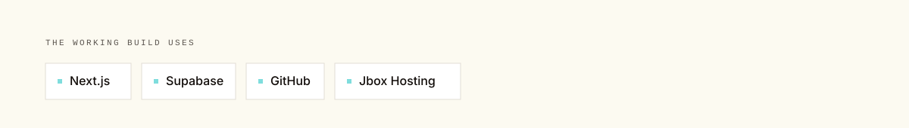   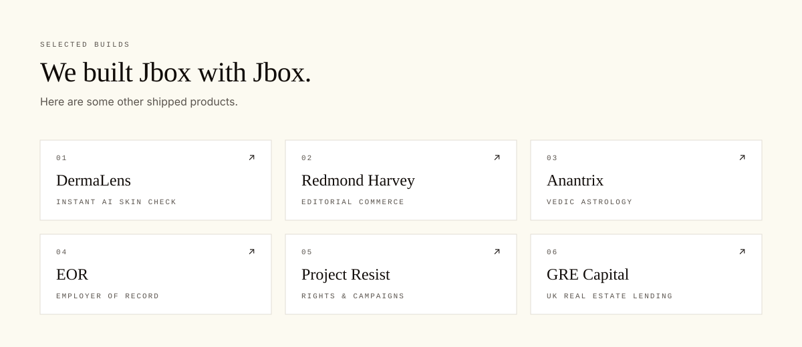 
 <a href="https://dermalens.io/">DermaLens</a> &nbsp;·&nbsp; <a href="https://www.redmondharveyclothing.com/">Redmond Harvey</a> &nbsp;·&nbsp; <a href="https://www.anantrix.in/">Anantrix</a> &nbsp;·&nbsp; <a href="https://fronted.com/employer-of-record">EOR</a> &nbsp;·&nbsp; <a href="https://www.projectresist.org.uk/">Project Resist</a> &nbsp;·&nbsp; <a href="https://www.grecapital.com/">GRE Capital</a> 
   <a href="https://www.g2.com/products/jbox/reviews"> 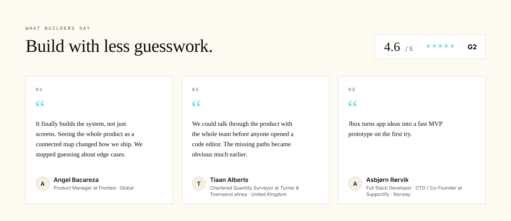 </a> 
 <a href="https://www.linkedin.com/in/angel-b-412126176/">Angel Bacareza</a> &nbsp;·&nbsp; <a href="https://www.linkedin.com/in/tiaan-alberts-7277076b">Tiaan Alberts</a> &nbsp;·&nbsp; <a href="https://www.linkedin.com/in/asbjornrorvik">Asbjørn Rørvik</a> 
   <a href="https://jboxai.com"> 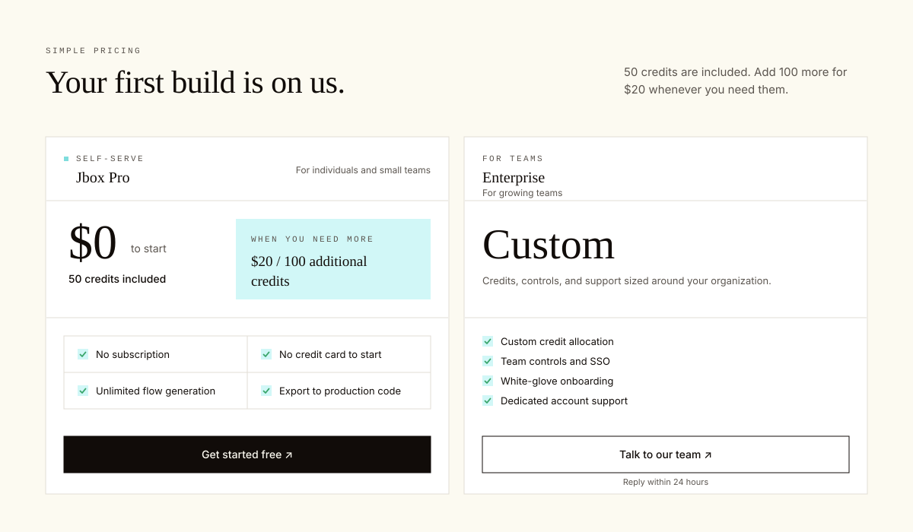 </a> 
 <a href="https://jboxai.com"><b>Get started free →</b></a> &nbsp;&nbsp;&nbsp; <a href="mailto:contact@jboxai.com"><b>Talk to our team →</b></a> Reply within 24 hours 
   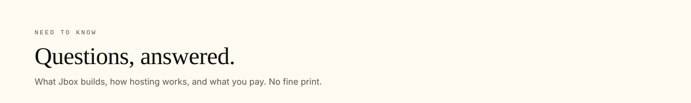 
 
<b>What does Jbox generate?</b>
   Complete, multi-role product flows with screens, logic, and edge cases. They are wired to production-ready code you can export. 
 
 
<b>Is Jbox an AI to code tool?</b>
   Jbox goes further than code generation. It maps every role, screen, decision and handoff first, then builds a connected, hosted product from that map, so nothing gets lost between the brief and the build. 
 
 
<b>Can I use Jbox for prompt to code workflows?</b>
   Yes. You can describe a product in plain language and use Jbox as a prompt to code workflow that maps roles, screens, logic, and edge cases before export. 
 
 
<b>How does hosting work?</b>
   Every build ships on Jbox Hosting, live and connected, not a prototype. You can also export to production code and connect your own GitHub repository. 
   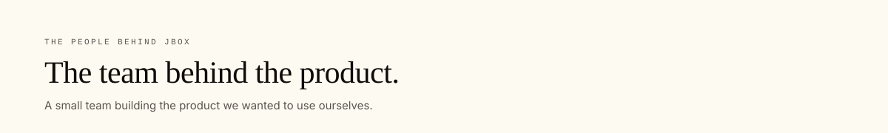 <table> <tr> <td align="center" width="33%">    <b><a href="https://linkedin.com/in/jacques-louw-32590aa2">Jacques Louw</a></b>  CO-FOUNDER </td> <td align="center" width="33%">    <b><a href="https://linkedin.com/in/saurav-chanda">Saurav Chanda</a></b>  CO-FOUNDER </td> <td align="center" width="33%">    <b><a href="https://www.linkedin.com/in/pawanpyakurel/">Pawan Pyakurel</a></b>  FULL STACK ENGINEER </td> </tr> </table>   <a href="https://jboxai.com"> 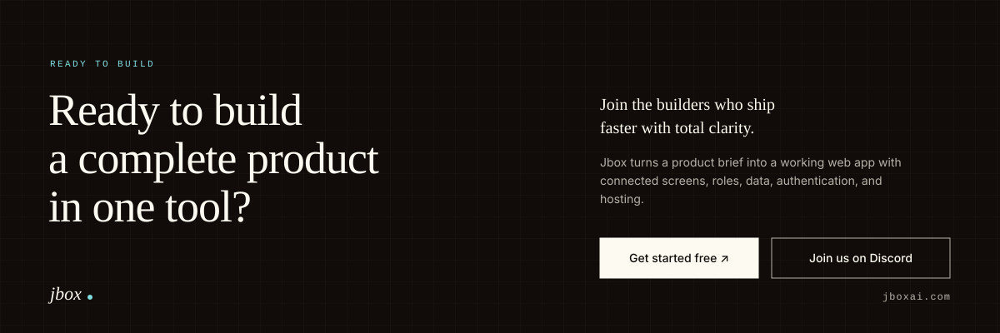 </a> 
 <a href="https://jboxai.com"><b>Get started free →</b></a> &nbsp;&nbsp;&nbsp; <a href="https://discord.gg/G2WprasNrq"><b>Join the builders on Discord →</b></a> 
 
 © 2026 Jbox. All rights reserved. &nbsp;·&nbsp; <a href="https://jboxai.com/terms/">Terms of Service</a> &nbsp;·&nbsp; <a href="https://jboxai.com/privacy-policy/">Privacy Policy</a> &nbsp;·&nbsp; <a href="mailto:contact@jboxai.com">contact@jboxai.com</a>  <i>Your product flow orchestrator</i> 

jboxai.com
